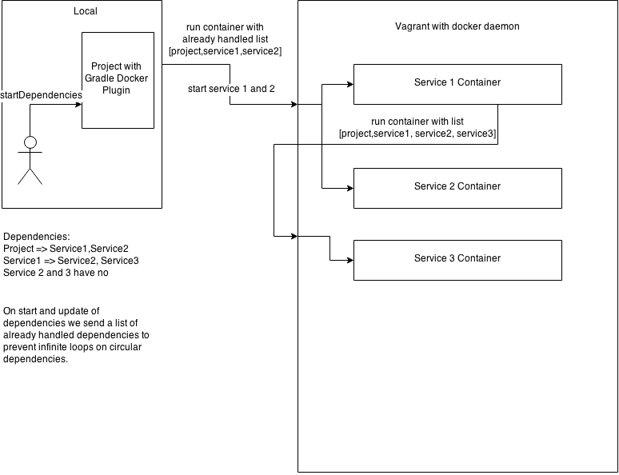

#Start and Update dependencies
If the startDependencies task is executed the project will take the list of depending services and start them if necessary. If they already run it will run an additional command in the container that also checks for the dependencies and starts them. In fact the startDependencies task  is a recursive task because it starts itself in the containers. With this workflow a service don't need to know the dependencies of it's own dependencies.

##Example overview
